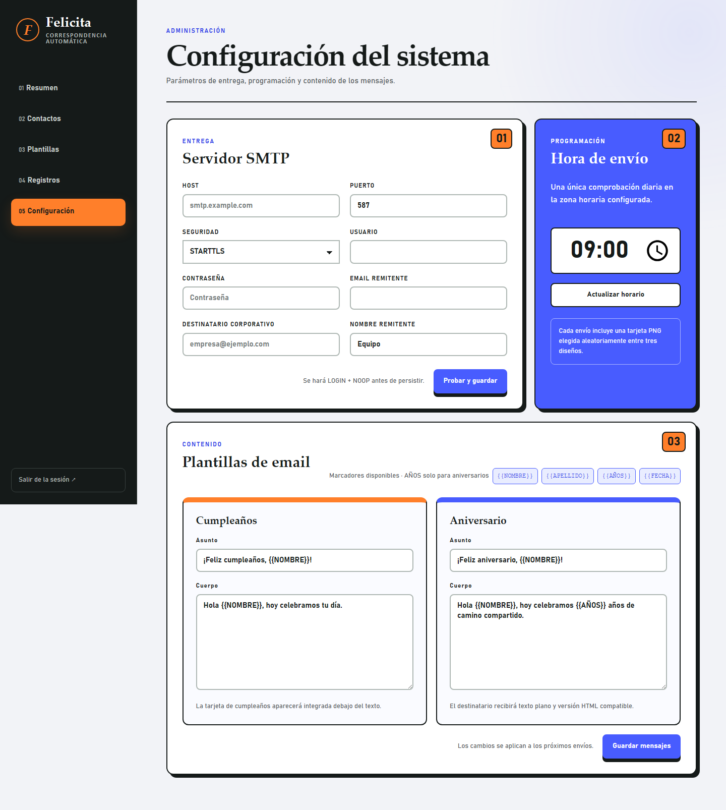
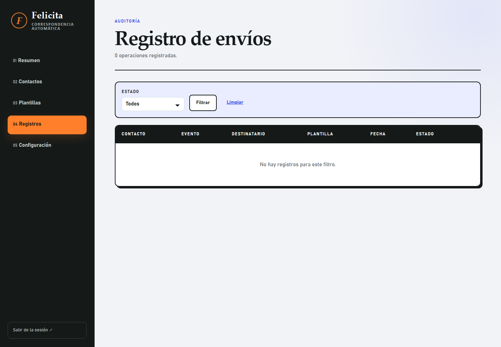

# Operación

## Primer arranque

1. Copia `.env.example` a `.env`.
2. Define `APP_SECRET` con al menos 32 caracteres aleatorios.
3. Define `ADMIN_PASSWORD` con una contraseña larga.
4. Ejecuta:

```bash
docker compose up --build -d
```

5. Entra en `http://localhost:8000`.

## Configuración inicial desde la UI

1. Crea contactos activos.
2. Configura SMTP.
3. Configura el destinatario corporativo.
4. Envía un email de prueba.
5. Ajusta la hora diaria de envío.
6. Revisa las plantillas y los textos de email.



## Logs y reintentos

La sección Registros muestra envíos correctos, fallidos y en proceso. Un fallo se puede reintentar desde la UI.

Los envíos `processing` se consideran recuperables tras el tiempo definido en `PROCESSING_STALE_MINUTES`.



## Backup

El dato crítico está en:

```text
/app/data/felicita.db
```

Si usas el volumen Docker por defecto, haz backup de `felicita_data`. Para una copia consistente, detén el contenedor o usa herramientas de backup de SQLite.

## Actualización de código

Después de cambiar código, plantillas o dependencias:

```bash
docker compose up --build -d
```

Las previews cacheadas se regeneran automáticamente cuando cambia una plantilla `.tex` o `latex_templates/brand.tex`.

## Problemas habituales

- Error `lmodern.sty not found`: reconstruye la imagen Docker. El `Dockerfile` instala `lmodern`.
- Error SMTP: verifica host, puerto, seguridad, usuario, contraseña y permisos de envío del proveedor.
- No se envía nada: comprueba que el contacto esté activo, que la fecha coincida y que exista destinatario corporativo.
- Duplicados: la restricción `contact_id + event_type + event_date` evita envíos duplicados para el mismo día.
