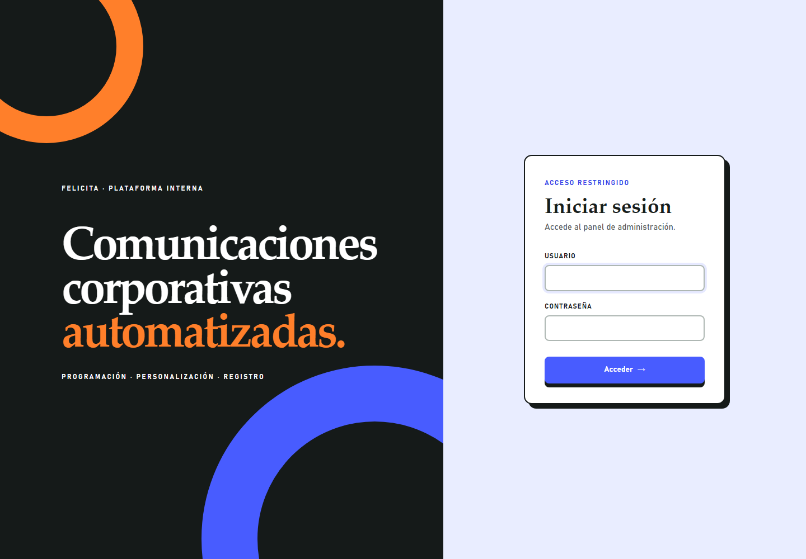
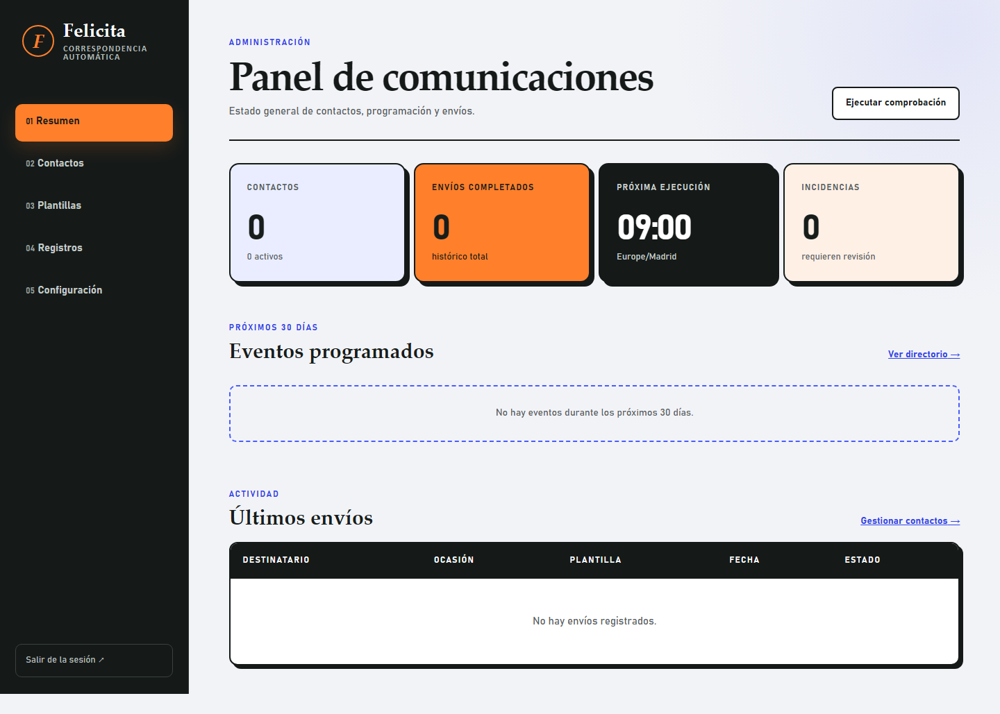
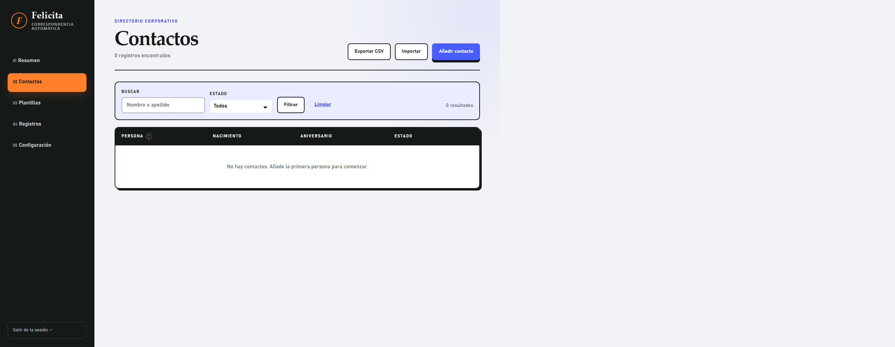
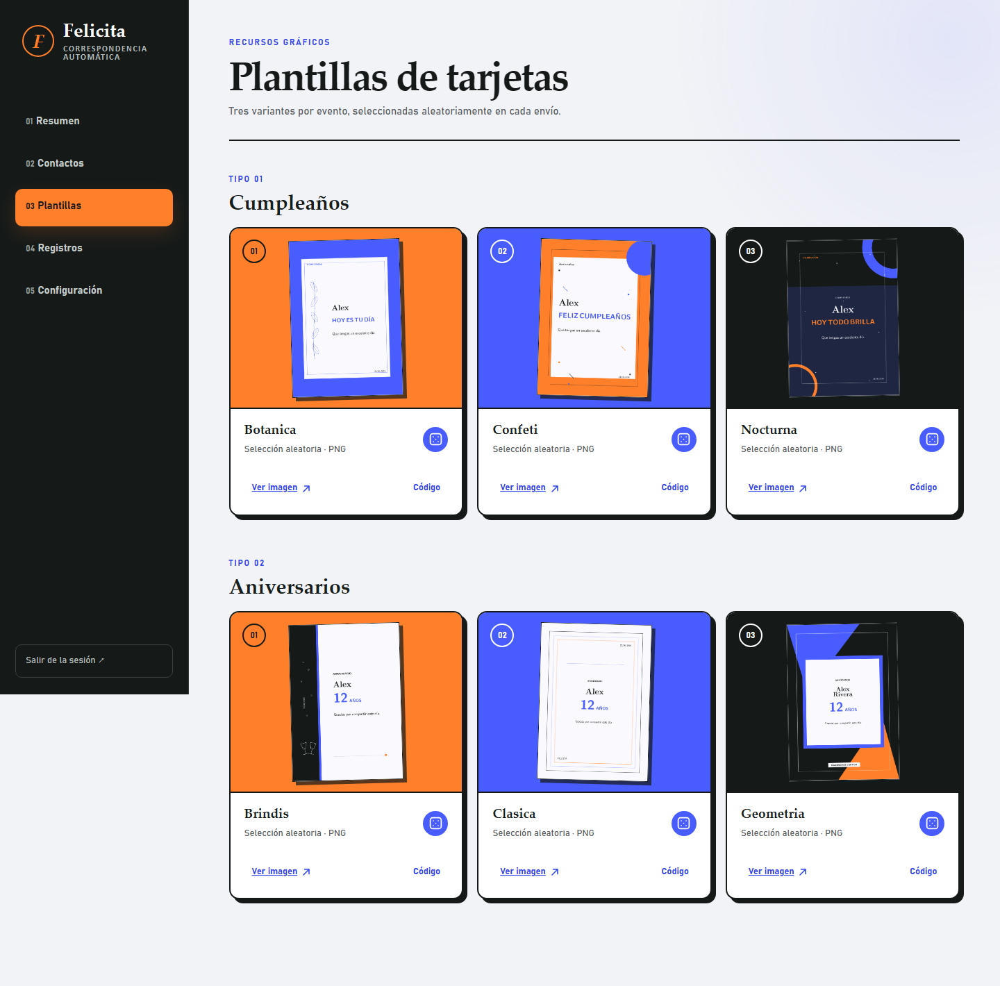

# Guía visual

Esta página agrupa la identidad básica y las pantallas principales del panel.

## Logo

El logo documentado está en `docs/assets/brand/felicita-logo.svg` y replica el favicon usado por la aplicación en `app/static/favicon.svg`.

## Acceso

## Resumen

## Contactos

## Plantillas

## Registros

## Configuración

